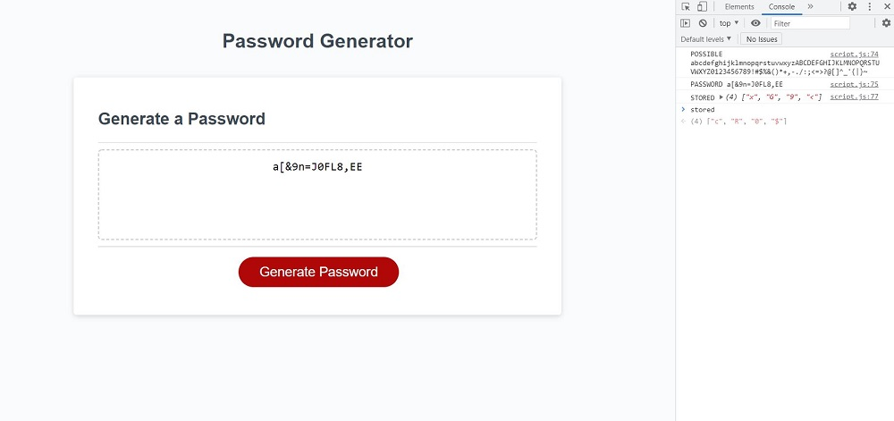

# password-generator
Password Generator

## Description
Designed Javascript code to generate a random password at the click of a button within given parameters.

## Links
[Source Code](https://github.com/asantercureton/password-generator)

[Description Link](https://asantercureton.github.io/personal-portfolio/)

## Usage
Generates a random password at the click of a button that is at least 8 characters long.

## Screenshots
Below is a screenshot of the project:

---
© 2021 Password Generator.